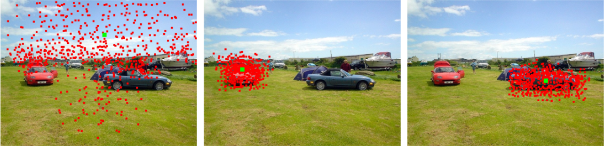
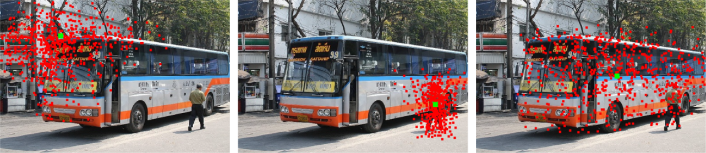
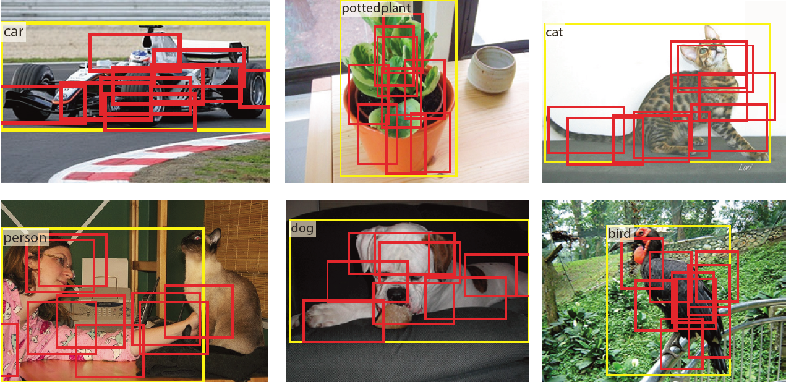

# Deformable Convolutional Networks


The major contributors of this repository include [Yuwen Xiong](https://github.com/Orpine), [Haozhi Qi](https://github.com/Oh233), [Guodong Zhang](https://github.com/gd-zhang), [Yi Li](https://github.com/liyi14), [Jifeng Dai](https://github.com/daijifeng001), [Bin Xiao](https://github.com/leoxiaobin), [Han Hu](https://github.com/ancientmooner) and  [Yichen Wei](https://github.com/YichenWei).

**We released training/testing code and pre-trained models of Deformable FPN, which is the foundation of our COCO detection 2017 entry.** Slides at [COCO 2017 workshop](http://presentations.cocodataset.org/COCO17-Detect-MSRA.pdf).

**[A third-party improvement](https://github.com/bharatsingh430/Deformable-ConvNets) of Deformable R-FCN + Soft NMS**


## Introduction

**Deformable ConvNets** is initially described in an [ICCV 2017 oral paper](https://arxiv.org/abs/1703.06211). (Slides at [ICCV 2017 Oral](http://www.jifengdai.org/slides/Deformable_Convolutional_Networks_Oral.pdf))

**R-FCN** is initially described in a [NIPS 2016 paper](https://arxiv.org/abs/1605.06409).






## Disclaimer

This is an official implementation for [Deformable Convolutional Networks](https://arxiv.org/abs/1703.06211) (Deformable ConvNets) based on MXNet. It is worth noticing that:

  * The original implementation is based on our internal Caffe version on Windows. There are slight differences in the final accuracy and running time due to the plenty details in platform switch.
  * The code is tested on official [MXNet@(commit 62ecb60)](https://github.com/dmlc/mxnet/tree/62ecb60) with the extra operators for Deformable ConvNets.
  	* After [MXNet@(commit ce2bca6)](https://github.com/dmlc/mxnet/tree/ce2bca6) the offical MXNet support all operators for Deformable ConvNets.
  * We trained our model based on the ImageNet pre-trained [ResNet-v1-101](https://github.com/KaimingHe/deep-residual-networks) using a [model converter](https://github.com/dmlc/mxnet/tree/430ea7bfbbda67d993996d81c7fd44d3a20ef846/tools/caffe_converter). The converted model produces slightly lower accuracy (Top-1 Error on ImageNet val: 24.0% v.s. 23.6%).
  * This repository used code from [MXNet rcnn example](https://github.com/dmlc/mxnet/tree/master/example/rcnn) and [mx-rfcn](https://github.com/giorking/mx-rfcn).
  
## License

© Microsoft, 2017. Licensed under an MIT license.

## Citing Deformable ConvNets

If you find Deformable ConvNets useful in your research, please consider citing:
```
@article{dai17dcn,
    Author = {Jifeng Dai, Haozhi Qi, Yuwen Xiong, Yi Li, Guodong Zhang, Han Hu, Yichen Wei},
    Title = {Deformable Convolutional Networks},
    Journal = {arXiv preprint arXiv:1703.06211},
    Year = {2017}
}
@inproceedings{dai16rfcn,
    Author = {Jifeng Dai, Yi Li, Kaiming He, Jian Sun},
    Title = {{R-FCN}: Object Detection via Region-based Fully Convolutional Networks},
    Conference = {NIPS},
    Year = {2016}
}
```

## Main Results

|                                 | training data     | testing data | mAP@0.5 | mAP@0.7 | time   |
|---------------------------------|-------------------|--------------|---------|---------|--------|
| R-FCN, ResNet-v1-101            | VOC 07+12 trainval| VOC 07 test  | 79.6    | 63.1    | 0.16s |
| Deformable R-FCN, ResNet-v1-101 | VOC 07+12 trainval| VOC 07 test  | 82.3    | 67.8    | 0.19s |


|                                 | <sub>training data</sub> | <sub>testing data</sub>  | <sub>mAP</sub>  | <sub>mAP@0.5</sub> | <sub>mAP@0.75</sub>| <sub>mAP@S</sub> | <sub>mAP@M</sub> | <sub>mAP@L</sub> |
|---------------------------------|---------------|---------------|------|---------|---------|-------|-------|-------|
| <sub>R-FCN, ResNet-v1-101 </sub>           | <sub>coco trainval</sub> | <sub>coco test-dev</sub> | 32.1 | 54.3    |   33.8  | 12.8  | 34.9  | 46.1  | 
| <sub>Deformable R-FCN, ResNet-v1-101</sub> | <sub>coco trainval</sub> | <sub>coco test-dev</sub> | 35.7 | 56.8    | 38.3    | 15.2  | 38.8  | 51.5  |
| <sub>Faster R-CNN (2fc), ResNet-v1-101 </sub>           | <sub>coco trainval</sub> | <sub>coco test-dev</sub> | 30.3 | 52.1    |   31.4  | 9.9  | 32.2  | 47.4  | 
| <sub>Deformable Faster R-CNN (2fc), </br>ResNet-v1-101</sub> | <sub>coco trainval</sub> | <sub>coco test-dev</sub> | 35.0 | 55.0    | 38.3    | 14.3  | 37.7  | 52.0  |

|                                 | <sub>training data</sub> | <sub>testing data</sub>  | <sub>mAP</sub>  | <sub>mAP@0.5</sub> | <sub>mAP@0.75</sub>| <sub>mAP@S</sub> | <sub>mAP@M</sub> | <sub>mAP@L</sub> |
|---------------------------------|---------------|---------------|------|---------|---------|-------|-------|-------|
| <sub> FPN+OHEM, ResNet-v1-101 </sub>            | <sub>coco trainval35k</sub> | <sub>coco minival</sub> | 37.8 | 60.8 | 41.0 | 22.0  | 41.5  | 49.8  | 
| <sub>Deformable FPN + OHEM, ResNet-v1-101</sub> | <sub>coco trainval35k</sub> | <sub>coco minival</sub> | 41.2 | 63.5 | 45.5 | 24.3  | 44.9  | 54.4  |
| <sub> FPN + OHEM + Soft NMS + multi-scale testing, </br>ResNet-v1-101 </sub>   | <sub>coco trainval35k</sub> | <sub>coco minival</sub> | 40.9 | 62.5    |   46.0  | 27.1  | 44.1  | 52.2  | 
| <sub> Deformable FPN + OHEM + Soft NMS + multi-scale testing, ResNet-v1-101</sub> | <sub>coco trainval35k</sub> | <sub>coco minival</sub> | 44.4 | 65.5    | 50.2   | 30.8 | 47.3 | 56.4  |

|                                   | training data              | testing data   | mIoU | time  |
|-----------------------------------|----------------------------|----------------|------|-------|
| DeepLab, ResNet-v1-101            | Cityscapes train           | Cityscapes val | 70.3 | 0.51s |
| Deformable DeepLab, ResNet-v1-101 | Cityscapes train           | Cityscapes val | 75.2 | 0.52s |
| DeepLab, ResNet-v1-101            | VOC 12 train (augmented) | VOC 12 val   | 70.7 | 0.08s |
| Deformable DeepLab, ResNet-v1-101 | VOC 12 train (augmented) | VOC 12 val   | 75.9 | 0.08s |


*Running time is counted on a single Maxwell Titan X GPU (mini-batch size is 1 in inference).*

## Requirements: Software

1. MXNet from [the offical repository](https://github.com/dmlc/mxnet). We tested our code on [MXNet@(commit 62ecb60)](https://github.com/dmlc/mxnet/tree/62ecb60). Due to the rapid development of MXNet, it is recommended to checkout this version if you encounter any issues. We may maintain this repository periodically if MXNet adds important feature in future release.

2. Python 2.7. We recommend using Anaconda2 as it already includes many common packages. We do not support Python 3 yet, if you want to use Python 3 you need to modify the code to make it work.


3. Python packages might missing: cython, opencv-python >= 3.2.0, easydict. If `pip` is set up on your system, those packages should be able to be fetched and installed by running
	```
	pip install -r requirements.txt
	```
4. For Windows users, Visual Studio 2015 is needed to compile cython module.


## Requirements: Hardware

Any NVIDIA GPUs with at least 4GB memory should be OK.

## Installation

1. Clone the Deformable ConvNets repository, and we'll call the directory that you cloned Deformable-ConvNets as ${DCN_ROOT}.
```
git clone https://github.com/msracver/Deformable-ConvNets.git
```

2. For Windows users, run ``cmd .\init.bat``. For Linux user, run `sh ./init.sh`. The scripts will build cython module automatically and create some folders.

3. Install MXNet:
	
	**Note: The MXNet's Custom Op cannot execute parallelly using multi-gpus after this [PR](https://github.com/apache/incubator-mxnet/pull/6928). We strongly suggest the user rollback to version [MXNet@(commit 998378a)](https://github.com/dmlc/mxnet/tree/998378a) for training (following Section 3.2 - 3.5).**

	***Quick start***

	3.1 Install MXNet and all dependencies by 
	```
	pip install -r requirements.txt
	```
	If there is no other error message, MXNet should be installed successfully. 
	
	***Build from source (alternative way)***

	3.2 Clone MXNet and checkout to [MXNet@(commit 998378a)](https://github.com/dmlc/mxnet/tree/998378a) by
	```
	git clone --recursive https://github.com/dmlc/mxnet.git
	git checkout 998378a
	git submodule update
	# if it's the first time to checkout, just use: git submodule update --init --recursive
	```
	3.3 Compile MXNet
	```
	cd ${MXNET_ROOT}
	make -j $(nproc) USE_OPENCV=1 USE_BLAS=openblas USE_CUDA=1 USE_CUDA_PATH=/usr/local/cuda USE_CUDNN=1
	```
	3.4 Install the MXNet Python binding by
	
	***Note: If you will actively switch between different versions of MXNet, please follow 3.5 instead of 3.4***
	```
	cd python
	sudo python setup.py install
	```
	3.5 For advanced users, you may put your Python packge into `./external/mxnet/$(YOUR_MXNET_PACKAGE)`, and modify `MXNET_VERSION` in `./experiments/rfcn/cfgs/*.yaml` to `$(YOUR_MXNET_PACKAGE)`. Thus you can switch among different versions of MXNet quickly.

4. For Deeplab, we use the argumented VOC 2012 dataset. The argumented annotations are provided by [SBD](http://home.bharathh.info/pubs/codes/SBD/download.html) dataset. For convenience, we provide the converted PNG annotations and the lists of train/val images, please download them from [OneDrive](https://1drv.ms/u/s!Am-5JzdW2XHzhqMRhVImMI1jRrsxDg).

## Demo & Deformable Model

We provide trained deformable convnet models, including the deformable R-FCN & Faster R-CNN models trained on COCO trainval, and the deformable DeepLab model trained on CityScapes train.

1. To use the demo with our pre-trained deformable models, please download manually from [OneDrive](https://1drv.ms/u/s!Am-5JzdW2XHzhqMSjehIcCgAhvEAHw) or [BaiduYun](https://pan.baidu.com/s/1dFlPFED), and put it under folder `model/`.

	Make sure it looks like this:
	```
	./model/rfcn_dcn_coco-0000.params
	./model/rfcn_coco-0000.params
	./model/fpn_dcn_coco-0000.params
	./model/fpn_coco-0000.params
	./model/rcnn_dcn_coco-0000.params
	./model/rcnn_coco-0000.params
	./model/deeplab_dcn_cityscapes-0000.params
	./model/deeplab_cityscapes-0000.params
	./model/deform_conv-0000.params
	./model/deform_psroi-0000.params
	```
2. To run the R-FCN demo, run
	```
	python ./rfcn/demo.py
	```
	By default it will run Deformable R-FCN and gives several prediction results, to run R-FCN, use
	```
	python ./rfcn/demo.py --rfcn_only
	```
3. To run the DeepLab demo, run
	```
	python ./deeplab/demo.py
	```
	By default it will run Deformable Deeplab and gives several prediction results, to run DeepLab, use
	```
	python ./deeplab/demo.py --deeplab_only
	```
4. To visualize the offset of deformable convolution and deformable psroipooling, run
	```
	python ./rfcn/deform_conv_demo.py
	python ./rfcn/deform_psroi_demo.py
	```


## Preparation for Training & Testing

For R-FCN/Faster R-CNN\:
1. Please download COCO and VOC 2007+2012 datasets, and make sure it looks like this:

	```
	./data/coco/
	./data/VOCdevkit/VOC2007/
	./data/VOCdevkit/VOC2012/
	```

2. Please download ImageNet-pretrained ResNet-v1-101 model manually from [OneDrive](https://1drv.ms/u/s!Am-5JzdW2XHzhqMEtxf1Ciym8uZ8sg), and put it under folder `./model`. Make sure it looks like this:
	```
	./model/pretrained_model/resnet_v1_101-0000.params
	```

For DeepLab\:
1. Please download Cityscapes and VOC 2012 datasets and make sure it looks like this:

	```
	./data/cityscapes/
	./data/VOCdevkit/VOC2012/
	```
2. Please download argumented VOC 2012 annotations/image lists, and put the argumented annotations and the argumented train/val lists into:

	```
	./data/VOCdevkit/VOC2012/SegmentationClass/
	./data/VOCdevkit/VOC2012/ImageSets/Main/
	```
   , Respectively.
   
2. Please download ImageNet-pretrained ResNet-v1-101 model manually from [OneDrive](https://1drv.ms/u/s!Am-5JzdW2XHzhqMEtxf1Ciym8uZ8sg), and put it under folder `./model`. Make sure it looks like this:
	```
	./model/pretrained_model/resnet_v1_101-0000.params
	```
## Usage

1. All of our experiment settings (GPU #, dataset, etc.) are kept in yaml config files at folder `./experiments/rfcn/cfgs`, `./experiments/faster_rcnn/cfgs` and `./experiments/deeplab/cfgs/`.
2. Eight config files have been provided so far, namely, R-FCN for COCO/VOC, Deformable R-FCN for COCO/VOC, Faster R-CNN(2fc) for COCO/VOC, Deformable Faster R-CNN(2fc) for COCO/VOC, Deeplab for Cityscapes/VOC and Deformable Deeplab for Cityscapes/VOC, respectively. We use 8 and 4 GPUs to train models on COCO and on VOC for R-FCN, respectively. For deeplab, we use 4 GPUs for all experiments.

3. To perform experiments, run the python scripts with the corresponding config file as input. For example, to train and test deformable convnets on COCO with ResNet-v1-101, use the following command
    ```
    python experiments\rfcn\rfcn_end2end_train_test.py --cfg experiments\rfcn\cfgs\resnet_v1_101_coco_trainval_rfcn_dcn_end2end_ohem.yaml
    ```
    A cache folder would be created automatically to save the model and the log under `output/rfcn_dcn_coco/`.
4. Please find more details in config files and in our code.

## Misc.

Code has been tested under:

- Ubuntu 14.04 with a Maxwell Titan X GPU and Intel Xeon CPU E5-2620 v2 @ 2.10GHz
- Windows Server 2012 R2 with 8 K40 GPUs and Intel Xeon CPU E5-2650 v2 @ 2.60GHz
- Windows Server 2012 R2 with 4 Pascal Titan X GPUs and Intel Xeon CPU E5-2650 v4 @ 2.30GHz

## FAQ

Q: It says `AttributeError: 'module' object has no attribute 'DeformableConvolution'`.

A: This is because either
 - you forget to copy the operators to your MXNet folder
 - or you copy to the wrong path
 - or you forget to re-compile
 - or you install the wrong MXNet

    Please print `mxnet.__path__` to make sure you use correct MXNet

<br/><br/>
Q: I encounter `segment fault` at the beginning.

A: A compatibility issue has been identified between MXNet and opencv-python 3.0+. We suggest that you always `import cv2` first before `import mxnet` in the entry script. 

<br/><br/>
Q: I find the training speed becomes slower when training for a long time.

A: It has been identified that MXNet on Windows has this problem. So we recommend to run this program on Linux. You could also stop it and resume the training process to regain the training speed if you encounter this problem.

<br/><br/>
Q: Can you share your caffe implementation?

A: Due to several reasons (code is based on a old, internal Caffe, port to public Caffe needs extra work, time limit, etc.). We do not plan to release our Caffe code. Since current MXNet convolution implementation is very similar to Caffe (almost the same), it is easy to port to Caffe by yourself, the core CUDA code could be kept unchanged. Anyone who wish to do it is welcome to make a pull request.
